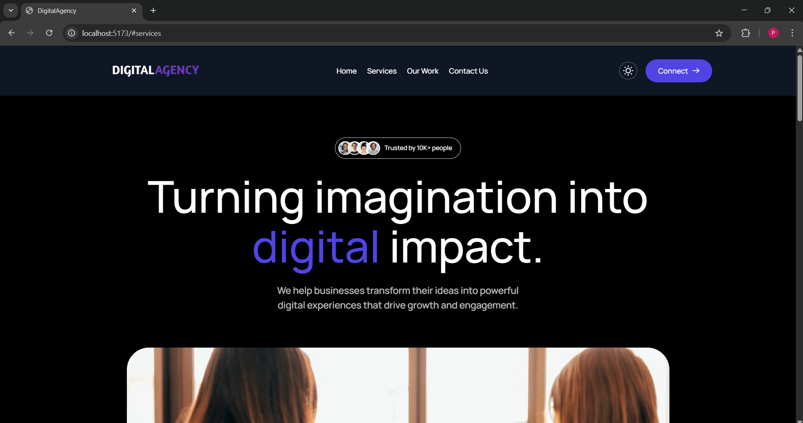
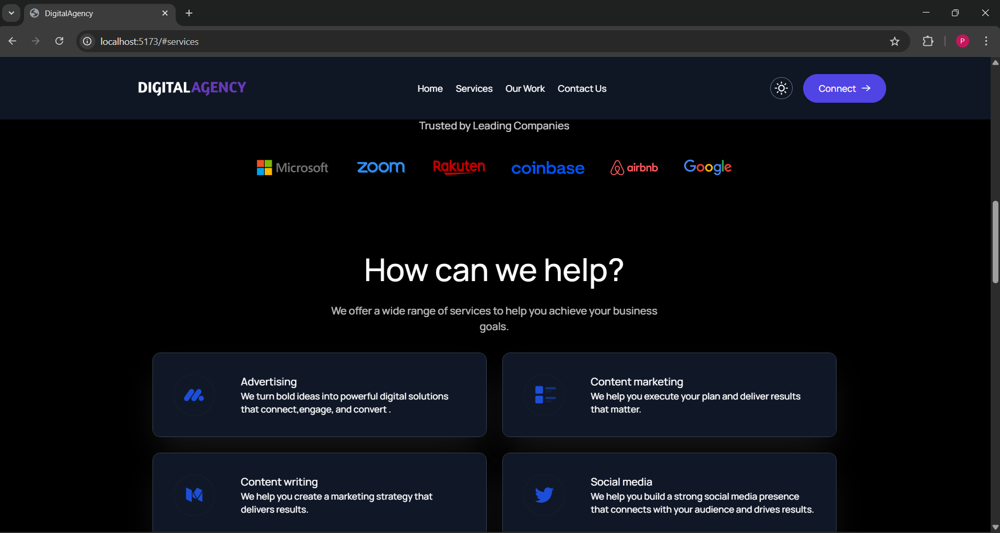
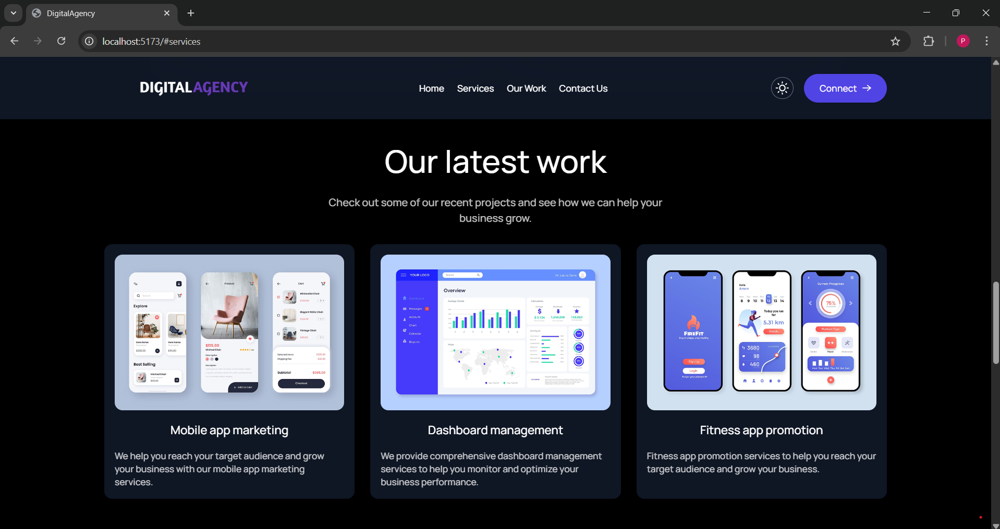
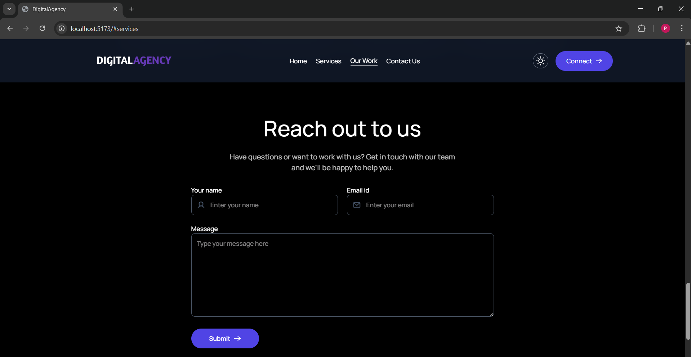
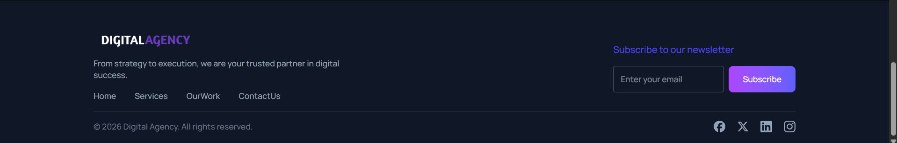
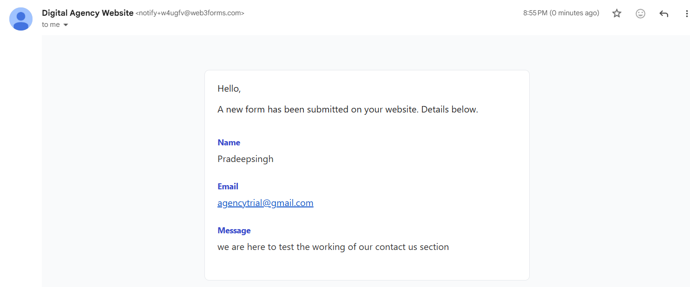
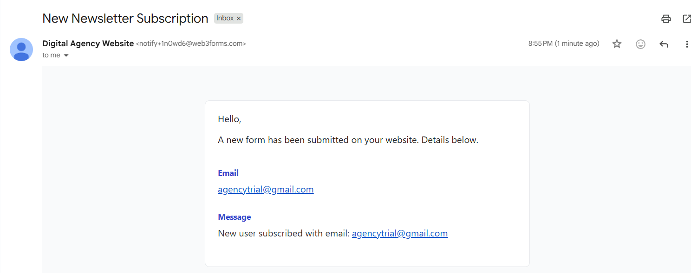

# DigitalAgency 

DigitalAgency is a modern and fully responsive digital agency website built using React and Tailwind CSS.  
The project includes smooth animations, theme switching (Dark & Light mode), and working email integration for contact and newsletter subscriptions.

##Live website 
digitalagency-woad.vercel.app

## Features

- Built with React
- Styled using Tailwind CSS
- Light & Dark Theme Support
- Smooth Animations using Framer Motion
- Contact Form with Email Integration
- Newsletter Subscription System
- Admin receives emails for:
  - Contact form submissions
  - Newsletter subscriptions
- Responsive (Mobile & Desktop)

## 🛠 Tech Stack

- React
- Tailwind CSS
- Framer Motion
- Web3Forms (Email Handling)

## 📸 Screenshots

> Note: The screenshots below showcase the Dark Theme version of the website.

### 🏠 Home Section


### 🛠 Services Section


### 💼 Our Work Section


### 📩 Contact Us Section


### 📌 Footer Section


### 📬 Admin Email - Contact Form


### 📬 Admin Email - Newsletter Subscription



## 📂 Installation

```bash
git clone https://github.com/pradeep-lab-code/DigitalAgency.git
cd DigitalAgency
npm install
npm run dev

## 🔐 Environment Variables

To run this project locally, create a `.env` file in the root directory and add:

VITE_WEB3FORMS_KEY=your_web3forms_access_key_here

You can get your access key from Web3Forms dashboard.
